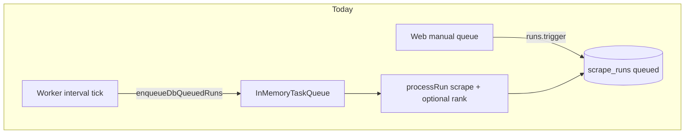
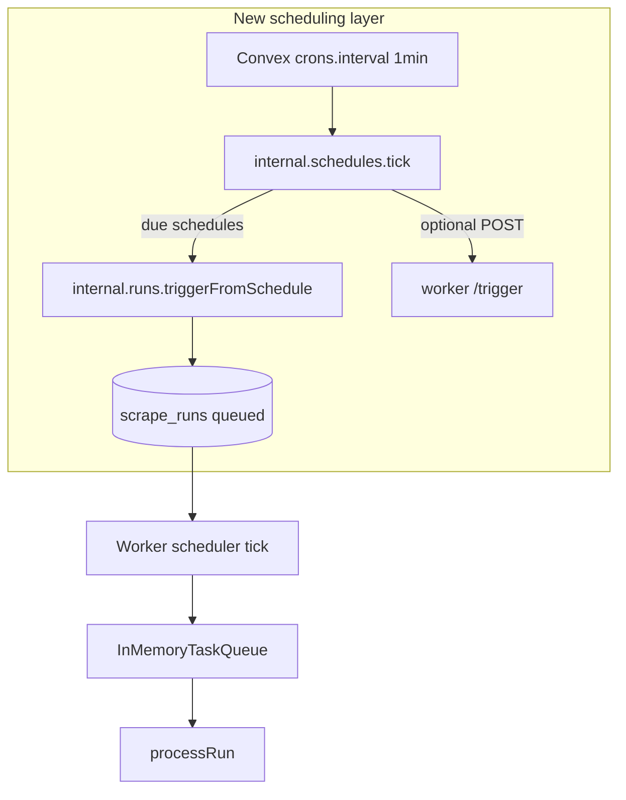

# Recurring scheduled worker queue items

## Current state (baseline)

Today the system already has a **durable queue** (`scrape_runs` with `status: 'queued'`) and a **worker dequeue loop** ([`apps/worker/src/scheduler.ts`](apps/worker/src/scheduler.ts)) that only calls `enqueueDbQueuedRuns()` — it never auto-creates runs. Manual queueing uses [`runs.trigger`](convex/runs.ts). Ranking during a run is gated by the **worker-global** `WORKER_ENABLE_LLM_RANKING` flag in [`processRun`](apps/worker/src/orchestrator.ts), not per run.

Dead code: [`enqueueScheduledRuns()`](apps/worker/src/orchestrator.ts) hard-codes LinkedIn and is unused; replace with the new Convex-driven model rather than reviving it on the worker.



## Target architecture

**Split responsibilities:**

| Layer | Responsibility |
|-------|----------------|
| **`worker_schedules` table** | User-defined recurring definitions (what to run, when, enabled) |
| **Convex cron + `schedules.tick`** | Evaluate due schedules, enqueue runs, advance `nextRunAt` |
| **`scrape_runs`** | Unchanged execution unit; worker still processes via existing pipeline |
| **Worker poll (`WORKER_CRON_INTERVAL_MINUTES`)** | Unchanged: pick up queued rows; optionally nudged sooner via HTTP `/trigger` |



**Why Convex cron (not worker `setInterval` for user schedules):**

- Fires even if the worker process is stopped briefly — runs land in Convex as `queued`.
- Matches your choice to **catch up once** when a daily slot was missed while offline.
- Aligns with [Convex scheduling guidelines](convex/_generated/ai/guidelines.md) (`crons.interval` / `crons.cron` only).

The existing worker interval remains the **dequeue poll**, not the user’s “every X hours” or “daily at 9:00” semantics.

---

## Data model: `worker_schedules`

New table in [`convex/schema.ts`](convex/schema.ts):

```ts
worker_schedules: defineTable({
  name: v.string(),
  isEnabled: v.boolean(),

  // What to run (mirrors manual queue)
  source: v.string(),
  sourceCriteria: v.optional(v.record(v.string(), v.string())),
  sourcePresetId: v.optional(v.id('source_presets')), // optional; resolved at fire time
  evaluatorId: v.optional(v.id('job_evaluators')),

  /** Per-schedule ranking; satisfies story 1 vs 2 without coupling to schedule kind. */
  enableRanking: v.boolean(),

  schedule: v.union(
    v.object({
      kind: v.literal('daily'),
      /** Local time "HH:mm" (24h), e.g. "09:30". */
      timeOfDay: v.string(),
      /** IANA timezone, e.g. "America/Chicago". */
      timezone: v.string(),
    }),
    v.object({
      kind: v.literal('interval'),
      /** Whole hours between runs (validate min 1, max e.g. 168). */
      intervalHours: v.number(),
    })
  ),

  nextRunAt: v.number(),
  lastTriggeredAt: v.optional(v.number()),
  lastRunId: v.optional(v.id('scrape_runs')),
  lastError: v.optional(v.string()),

  createdAt: v.number(),
  updatedAt: v.number(),
})
  .index('by_enabled_next_run', ['isEnabled', 'nextRunAt'])
  .index('by_updated_at', ['updatedAt']);
```

**Link runs back to schedules** — extend `scrape_runs`:

```ts
scheduleId: v.optional(v.id('worker_schedules')),
triggeredBy: v.optional(v.union(v.literal('manual'), v.literal('schedule'))),
enableRanking: v.optional(v.boolean()), // per-run override; default true for manual rows
```

Indexes: add `by_schedule_and_status` on `['scheduleId', 'status']` if needed for inflight checks (or query `by_status` + filter — acceptable at MVP scale).

---

## Schedule timing logic (`packages/shared`)

Add testable pure helpers, e.g. [`packages/shared/src/schedules/nextRunAt.ts`](packages/shared/src/schedules/nextRunAt.ts):

| Kind | `computeNextRunAt(schedule, afterMs)` |
|------|--------------------------------------|
| **daily** | Next local `timeOfDay` in `timezone` strictly after `afterMs` (use `Intl` / small tz lib only if needed; prefer explicit offset-free approach via `Temporal` if available in target runtime, otherwise a minimal well-tested helper). |
| **interval** | `afterMs + intervalHours * 3600_000` |

**Tick behavior** ([`convex/schedules.ts`](convex/schedules.ts) — new):

1. Query enabled schedules with `nextRunAt <= now` (index `by_enabled_next_run`).
2. For each due schedule:
   - **Inflight guard:** if any `scrape_runs` for this `scheduleId` is `queued` or `running`, skip (log `lastError` or a skip reason field) — avoids pile-up when a run is slow.
   - Resolve criteria: if `sourcePresetId`, load preset and merge/override with inline `sourceCriteria` (document precedence: preset base, inline overrides).
   - Call internal enqueue (below).
   - Set `lastTriggeredAt`, `lastRunId`, clear `lastError`.
   - Set `nextRunAt = computeNextRunAt(schedule, now)` — for overdue daily schedules this naturally implements **fire once then resume cadence** (your preference).
3. For interval schedules on **create**, set initial `nextRunAt = now + interval` (or `now` for “run soon” — document in UI; default: first fire after one full interval unless user clicks “Run now”).

**Convex cron** — new [`convex/crons.ts`](convex/crons.ts):

```ts
crons.interval('worker schedules tick', { minutes: 1 }, internal.schedules.tick, {});
```

One-minute granularity is enough for “daily at 9:00” and “every X hours”; document ±1 min jitter in README.

---

## Enqueue integration

### Internal trigger path

Add [`internal.runs.triggerFromSchedule`](convex/runs.ts) (or in `schedules.ts`) that:

- Reuses validation from public `runs.trigger` (`normalizeSourceCriteria`, enabled source check, evaluator active check).
- Inserts `scrape_runs` with `status: 'queued'`, `scheduleId`, `triggeredBy: 'schedule'`, `enableRanking` from schedule.
- Returns `runId` for `lastRunId`.

Keep public `runs.trigger` for manual queue; set `triggeredBy: 'manual'` and leave `scheduleId` unset.

### Optional worker wake (faster pickup)

After enqueue, `schedules.tick` may schedule `internal.schedules.wakeWorker` **action** that:

- Reads effective `VITE_WORKER_TRIGGER_URL` via existing [`appSettings`](convex/appSettings.ts) resolution pattern.
- `POST` to that URL (same as web “Trigger now”).
- Failures are non-fatal (worker poll still picks up within `WORKER_CRON_INTERVAL_MINUTES`).

Store URL in Convex env only if you want wake without reading settings — prefer **user setting** per AGENTS.md.

---

## Ranking: scrape-only vs scrape+rank

User stories map to **`enableRanking` on each schedule** (not implicit by kind):

- Story 1 (daily scrape + rank): `enableRanking: true`
- Story 2 (every X hours scrape only): `enableRanking: false`

**Worker change** in [`processRun`](apps/worker/src/orchestrator.ts):

```ts
const rankThisRun =
  this.enableLlmRanking && (runDoc.enableRanking ?? true);
if (rankThisRun) { /* existing ranking block */ }
```

Global `WORKER_ENABLE_LLM_RANKING=0` remains a kill-switch for all runs.

---

## UI and API surface

**Convex module** [`convex/schedules.ts`](convex/schedules.ts):

- `list`, `get`
- `create`, `update`, `remove`
- `setEnabled`
- `runNow` (mutation: enqueue immediately + bump `nextRunAt` forward)

**Web** — extend Workers area ([`HistoryViewer.tsx`](apps/web/src/components/HistoryViewer.tsx)):

- New `WorkerSchedulesPanel` (or tab): table of schedules with name, source, cadence summary, next/last run, enabled toggle, edit/delete, “Run now”.
- Create/edit form reuses [`SourceCriteriaFields`](apps/web/src/components/SourceCriteriaFields.tsx) + source/preset/evaluator patterns from [`ScrapeQueuePanel`](apps/web/src/components/ScrapeQueuePanel.tsx).
- Daily: time picker + timezone (default `Intl.DateTimeFormat().resolvedOptions().timeZone`).
- Interval: hours input with validation.

**History affordance:** show badge on `scrape_runs` rows when `triggeredBy === 'schedule'` (and link to schedule name if `scheduleId` set).

No new env vars required for core feature; document optional Convex env if wake URL cannot come from settings.

---

## Edge cases and rules

| Case | Behavior |
|------|----------|
| Disabled source | Tick records `lastError`, does not enqueue |
| Inactive evaluator on schedule | Fail at create/update; at fire time if deactivated later, fail tick with `lastError` |
| Slow run spans next slot | Inflight guard skips duplicate enqueue |
| Missed daily while offline | Fire once when back (`nextRunAt` in past), then recompute forward |
| Worker down | Runs accumulate as `queued`; no data loss |
| Delete schedule | Keep historical `scrape_runs`; optional `scheduleId` orphan is fine |
| Rename preset / edit criteria | Schedules store snapshot criteria at fire time OR re-resolve preset each fire — **re-resolve preset each fire** keeps schedules in sync with preset edits |

Remove or repurpose [`enqueueScheduledRuns`](apps/worker/src/orchestrator.ts) to avoid two scheduling mechanisms.

---

## Clarify naming in docs

Update [`README.md`](README.md) to distinguish:

- **Worker dequeue interval** (`WORKER_CRON_INTERVAL_MINUTES`) — how often the worker checks Convex for `queued` runs.
- **Recurring schedules** (`worker_schedules` + Convex cron) — how often new runs are **created**.

---

## Implementation phases

### Phase 1 — Backend core
- Schema + shared `nextRunAt` helpers + unit tests
- `convex/schedules.ts` CRUD + `tick` internal mutation
- `convex/crons.ts`
- `triggerFromSchedule` + `scrape_runs` fields
- Worker per-run ranking gate

### Phase 2 — UI
- Schedules panel on `/workers`
- Create/edit flows with validation messages from Convex

### Phase 3 — Polish
- Optional `wakeWorker` action
- Schedule column/badge in run history
- README + in-app hints

### Phase 4 — Cleanup
- Delete dead `enqueueScheduledRuns` (or make it call Convex — prefer delete)

---

## Testing

- **`packages/shared`**: `computeNextRunAt` for daily (DST boundaries), interval, overdue catch-up.
- **`convex-test`**: `tick` enqueues one run, advances `nextRunAt`, respects inflight guard, skips disabled source.
- **Worker**: small unit test that `enableRanking: false` on run doc skips ranking block (mock convex client if existing pattern allows).

---

## Out of scope (defer)

- Per-schedule concurrency limits (use global `WORKER_QUEUE_CONCURRENCY`)
- Auth/multi-tenant (app is single-user today)
- Convex Auth on schedule mutations (follow-up if auth is added later)
- Sub-hour intervals (can add `intervalMinutes` later without breaking schema if `schedule` union is extended)
